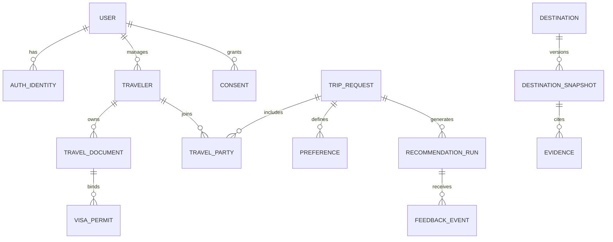
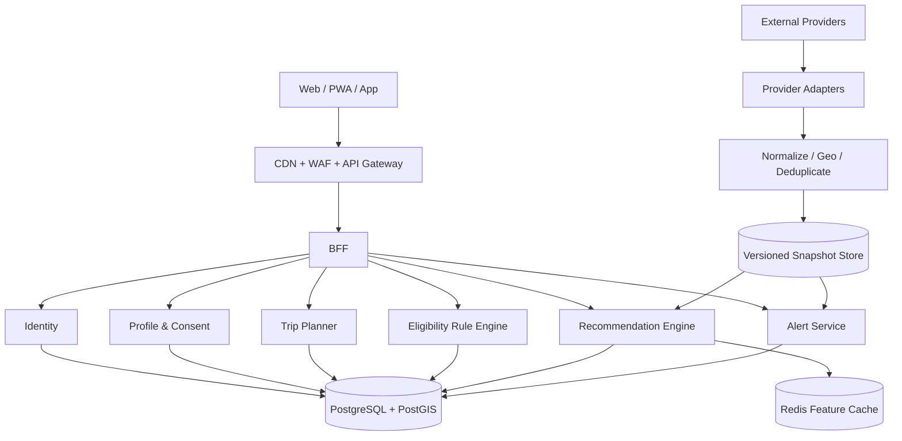

# 远择 FARWISE：全球个性化旅游推荐产品蓝图

版本：0.1
日期：2026-08-16
定位：面向中国与发达国家旅行者，优先解决“我现在能去哪里、哪里真正适合我、为什么”的可解释旅行推荐平台。

---

## 1. 一句话产品定义

远择不是“热门目的地榜单”，而是一个先判断 **证件与现实可行性**，再匹配 **兴趣、性格和旅行方式**，最后根据 **天气、价格、人流、安全与新闻** 动态校正的旅行决策引擎。

产品必须让用户始终能回答三个问题：

1. 为什么推荐这里？
2. 哪里可能不适合我？
3. 这条结论来自哪里、什么时候更新的？

### 核心原则

- 先排除“去不了”和“不应去”，再比较“更喜欢哪里”。
- 硬约束不能被兴趣高分抵消。
- 安全不压缩成一个来源不明的总分。
- 价格展示区间和超支概率，不伪装成精确数字。
- 天气预报与历史气候分开。
- 人流量在没有实时信号时明确标为“估计”。
- 生成模型负责解释与对话，不负责凭空判断签证、安全、价格或天气事实。
- 不根据姓名、照片、语言、Google 账户或出发地推断用户的种族、宗教、性取向或健康状况。
- 首次可匿名使用；需要同步、收藏多个方案或开启提醒时再登录。

---

## 2. 目标用户与高价值场景

### 2.1 核心用户

| 用户 | 典型需求 | 产品价值 |
|---|---|---|
| 中国大陆出境旅行者 | 签证复杂、假期有限、语言与支付差异 | 先做入境与时间可行性，再给完整成本和便利度 |
| 港澳台及海外华人 | 多本证件、常住地与国籍不同 | 按不同证件和航段计算，而不是只看“国籍” |
| 发达国家旅行者 | 选择很多，希望避开同质热门榜单 | 用个性、节奏、人流、交通与活动做深度匹配 |
| 多护照/多居留旅行者 | 不知道该用哪本证件、转机是否可行 | 输出逐航段证件使用方案与待核验项 |
| 独自旅行者 | 安全、夜间交通、社交或安静需求 | 按具体地区、时间和行动给提醒 |
| 亲子/带长辈/无障碍用户 | 所有人都要可行，限制条件多 | 以全体成员硬条件交集筛选 |
| 徒步、自驾、骑行、摩托等主题用户 | 普通旅游榜单无法体现路线难度 | 把驾照、路况、坡度、天气、装备和救援纳入推荐 |

### 2.2 首批高价值任务

- “我有中国护照和申根签证，9 月从上海出发 8 天，人均 1.8 万，想要安静、徒步和美食。”
- “一家四口，带 6 岁儿童和 68 岁长辈，哪里交通方便、少走路、医疗可达？”
- “我有美国和英国护照，经过第三国转机，哪种证件组合更省手续？”
- “10 月只能请 5 天假，接受高铁和自驾，不接受红眼航班。”
- “我想去海边，但不想去游客特别多的地方，预算可以为安静多花 15%。”
- “我已经想去某地，请帮我检查证件、天气、新闻、安全、酒店和当地交通是否合适。”

### 2.3 产品边界

首版不应该同时成为 OTA、签证代理、社交平台、点评社区和完整行程生成器。优先做好：

1. 目的地候选生成。
2. 可行性初筛。
3. 可解释排序。
4. 决策信息聚合。
5. 收藏、对比与动态提醒。

预订可先通过合规的合作链接完成。签证判断始终是“初筛 + 官方核验”，不能宣传为法律保证。

---

## 3. 用户旅程与页面结构

### 3.1 主旅程

```text
访客首页
  → 2 分钟基础问卷
  → 第一版推荐
  → 筛选 / 比较 / 反馈“不适合”
  → 目的地详情
  → 收藏为候选行程
  → 登录同步或设置提醒
  → 动态价格、证件、天气和安全更新
```

另保留两条入口：

- **先随便看看**：不填资料，浏览主题目的地和示例推荐。
- **检查一个已有目的地**：直接检查证件、日期、成本、天气、安全和交通。

### 3.2 页面信息架构

桌面端建议导航：

- 为我推荐
- 探索目的地
- 对比
- 我的行程
- 收藏
- 提醒
- 我的资料

移动端底部导航：推荐、探索、收藏、行程、我的。

核心页面：

1. 首页 / 自然语言搜索
2. 渐进式偏好问卷
3. 推荐结果（列表 / 地图）
4. 三至五个目的地对比
5. 目的地详情
6. 目的地可行性检查
7. 行程看板
8. 收藏夹
9. 动态提醒中心
10. 旅行证件与同行人资料
11. 数据来源与推荐方法
12. 隐私、同意和数据删除

### 3.3 登录时机

第一次推荐无需登录。以下行为再触发柔和登录提示：

- 跨设备同步。
- 保存第二个以上目的地。
- 创建行程或邀请同行人。
- 开启签证、价格、天气和安全提醒。

全球登录：Google、Apple、邮箱、Passkey。中国区补充微信、手机号等本地方式，不能只依赖 Google。

---

## 4. 数据设计：三层而不是一个“大画像”

产品应分开保存：

1. **旅行者画像**：相对稳定、可复用。
2. **本次行程请求**：只属于这次旅行。
3. **目的地时点快照**：天气、价格、人流、安全和新闻都随时间变化。

“国籍、护照签发地、常住地、当前出发地”必须是四个不同字段。

### 4.1 旅行者与同行人档案

每位同行者独立建档，团队推荐以“每个人、每一航段都可行”为硬条件。

#### 证件

- 护照或旅行证件签发国家/地区，可多个。
- 证件类型、到期月份。
- 永居、长期居留许可。
- 已有签证、电子旅行授权。
- 签证目的、有效期、入境次数、最长停留期。
- 签证绑定到哪本护照。
- 历史停留天数，例如申根 90/180 规则所需数据，可选。
- 不默认采集护照号码、出生日期、扫描件或照片。

#### 语言与支付

- 常用语言与当地语言沟通能力。
- 常用货币。
- 信用卡、现金、移动支付偏好。
- 是否需要稳定网络、eSIM、远程办公。

#### 同行结构

- 独自、伴侣、朋友、亲子、带长辈、团队、宠物。
- 儿童年龄段。
- 长者体力与医疗需求。
- 无障碍、轮椅、婴儿车、爬楼限制。
- 怀孕、过敏、慢性病等敏感信息只能自愿选填，并说明用途。

#### 保存范围

每个字段让用户选择：

- 仅用于本次旅行。
- 保存到长期偏好。
- 不保存，只在当前会话计算。

### 4.2 本次旅行约束

- 一个或多个出发城市、机场或车站。
- 可接受的邻近机场和跨城出发范围。
- 固定日期、弹性日期、月份或季节。
- 可前后移动天数。
- 总天数与工作日/周末结构。
- 单程、往返、开放口、多目的地。
- 最长门到门时间。
- 最多转机次数。
- 是否接受红眼航班、过夜转机、机场更换、跨境陆路。
- 同行人数与成员。
- 人均或总预算、币种。
- 预算是否包含交通、住宿、餐饮、活动、购物、签证和保险。
- 预算上浮范围。
- 是否接受不可退款预订。
- 是否可避开学校假期、节庆、会展和邮轮靠港日。
- 是否远程办公，所需时区与网络条件。

### 4.3 兴趣标签体系

首轮只展示大类；后续渐进追问。每项支持“必须有 / 加分 / 无所谓 / 不要”，并要求用户选出最不能放弃的前三项。

| 大类 | 细分标签 |
|---|---|
| 美食 | 本地菜、街头小吃、夜市、菜市场、米其林、精致餐饮、咖啡、茶、甜点、酒庄、精酿、烹饪课 |
| 自然 | 山地、森林、草原、湖泊、瀑布、沙漠、冰川、火山、极光、星空、花季、红叶、野生动物 |
| 徒步与运动 | 城市步行、徒步、露营、越野跑、骑行、攀岩、滑雪、潜水、冲浪、帆船、皮划艇、钓鱼、高尔夫 |
| 海滨度假 | 沙滩、海岛、海景、度假村、海岸公路、温暖海水、亲子水上活动 |
| 康养休息 | 温泉、SPA、按摩、瑜伽、冥想、数字戒断、慢住、睡眠恢复 |
| 历史文化 | 古城、遗址、博物馆、美术馆、现代与传统建筑、寺庙、宗教文化、非遗、传统工艺、文学电影 |
| 城市体验 | CBD、天际线、夜景、城市漫步、设计街区、咖啡馆、科技、动漫游戏、本地社区 |
| 娱乐活动 | 夜生活、酒吧、俱乐部、音乐节、演唱会、体育赛事、主题乐园、赌场 |
| 购物 | 奢侈品、免税、退税、奥特莱斯、本地品牌、电子产品、古董、跳蚤市场、设计师品牌 |
| 摄影 | 建筑、人文、自然、日出日落、夜景、观星、航拍、社交媒体出片 |
| 特殊目的 | 蜜月、纪念日、求婚、亲子教育、探亲、商务延伸、短暂停留、数字游民、志愿活动 |

购物模块不能只显示“免税店很多”，还应显示：

- 用户是否有退税资格。
- 最低消费。
- 退税方式和手续费。
- 离境办理时间。
- 回到常住国后的海关额度和潜在税费。

### 4.4 旅行性格：用行为维度替代单一 I/E 标签

I 人 / E 人可以作为易懂入口，但最终要落到可执行维度：

| 左侧 | 右侧 | 会影响什么 |
|---|---|---|
| 独处充电 | 社交充电 | 团体活动、夜生活、住宿公共空间 |
| 安静松弛 | 热闹高能 | 社区、夜间噪音、活动密度 |
| 经典稳妥 | 小众探索 | 地标权重、不确定性容忍度 |
| 规划明确 | 随性即兴 | 预约难度、临时可用库存 |
| 慢住一地 | 高频换城 | 城市数量、交通摩擦 |
| 城市便利 | 荒野自然 | 医疗、网络和交通覆盖 |
| 服务舒适 | 自助探索 | 酒店等级、导览和复杂度 |
| 早睡早起 | 夜生活型 | 活动时间和夜间交通 |
| 熟悉连锁 | 地道本地 | 餐饮、社区和服务一致性 |
| 可接受人群 | 尽量避开拥挤 | 高峰惩罚、人流预测 |
| 低体力 | 高强度 | 步行、坡度、海拔、活动时长 |
| 熟悉文化 | 文化差异越大越好 | 语言、礼仪和新鲜感 |

补充询问：

- 每日可步行距离与爬升。
- 高温、寒冷、潮湿、强风、海拔耐受。
- 是否晕车、晕船、恐高。
- 卫生差异、语言障碍和交通不确定性的容忍度。
- 是否愿意认识当地人、参加团体活动。
- 是否已经去过、是否介意重复目的地。

### 4.5 交通偏好

区分“到达目的地”和“目的地内部移动”。每种方式支持“喜欢 / 可接受 / 不要”。

#### 飞机

- 直飞优先、舱位、航司联盟、红眼、转机、行李。
- 最多转机次数和最短/最长中转时间。
- 是否接受机场更换、廉航、分开出票。
- 夜间到达和机场到酒店的末段交通。

#### 火车

- 高铁、普通列车、卧铺、景观列车。
- 最多换乘次数、行李、预约和通票。
- 准点率、站内步行和无障碍。

#### 自驾与电动车

- 驾照类型、国际驾照或翻译件。
- 左舵/右舵经验、自动挡需求。
- 每日最长驾驶时间。
- 山路、雪地、砂石路和夜间驾驶经验。
- 停车、收费道路、油价、保险和免赔额。
- 电动车充电覆盖、插头与路线冗余。

#### 摩托

- 驾照准驾车型、排量经验。
- 头盔与护具。
- 载人、行李、道路风险和保险覆盖。

#### 骑行和徒步

- 公路/山地、日里程、爬升、路面。
- 装备租赁、托运、维修点。
- 步道难度、日落时间、天气和救援可达性。

#### 公交、网约车、步行与轮渡

- 地铁和公交覆盖、班次、末班车、拥挤与支付。
- 网约车可用平台、绑卡、现金和夜间安全。
- 日均步数、坡度、楼梯、行李和婴儿车。
- 轮渡季节停航、晕船、是否载车。

### 4.6 住宿、饮食和生活底线

住宿：

- 酒店、民宿、青旅、度假村、公寓、露营。
- 独立卫生间、厨房、洗衣、电梯、空调、暖气、健身房、泳池。
- 必须靠近地铁、安静房、深夜入住、行李寄存。
- 儿童设施、无障碍、外宾住宿登记可行性。

饮食：

- 素食、纯素、清真、犹太洁食。
- 过敏原、无麸质、乳糖不耐。
- 辣度、生食接受度。
- 街头食品和饮水风险容忍度。
- 就餐时间、小费和预订习惯。

生活便利：

- 医疗、药房、便利店、公共厕所。
- 网络限制、常用地图和通讯 App。
- 插座、eSIM、现金、银行卡、移动支付。
- 营业时间、周日或节假日停业。

---

## 5. 推荐结果应该怎么呈现

### 5.1 结果页顶部

先总结当前条件：

> 从上海出发 · 9 月 · 7–10 天 · 人均 ¥18,000 · 自然 / 徒步 / 本地生活 · 希望安静

同时显示：

- 找到多少个满足硬条件的候选。
- 哪些条件导致候选被排除。
- 数据新鲜度。
- 证件和安全信息的核验声明。

支持列表/地图切换、目的地对比，以及按总费用、路程、人流、天气、签证便利度排序。

### 5.2 结果卡必备信息

每张卡至少包含：

- 目的地及推荐旅行范围。
- “高匹配 / 中匹配”，而不是只有一个神秘数字。
- 匹配拆解。
- 预计人均总费用 P50/P90 和包含项。
- 门到门时长与转机。
- 天气预报或历史气候，明确区分。
- 人流估计与置信度。
- 证件初筛四态：可直接前往 / 需完成手续 / 待人工确认 / 不满足。
- 3–5 个“为什么适合”。
- 2–3 个“你可能会介意”。
- 数据来源、更新时间和待核验项。

不要只给一个“最佳目的地”。首屏可以同时给出：

- 最稳妥。
- 最匹配。
- 性价比最高。
- 小众惊喜。
- 最方便。

### 5.3 反馈闭环

卡片支持：收藏、加入对比、不适合我、已经去过。

“不适合我”原因：

- 太贵。
- 路上太久。
- 太热门。
- 天气不喜欢。
- 签证太麻烦。
- 不符合兴趣。
- 住宿或交通不便。
- 已经去过。

反馈后要解释：

> 已降低“长途转机”和相似海岛目的地的权重。

### 5.4 无结果状态

不要只显示“没有结果”。应指出冲突并允许一次放宽一项：

> 暂时没有同时满足“7 天、人均 ¥5,000、直飞、安静海岛”的结果。

建议：

- 预算增加约 ¥1,500。
- 接受一次转机。
- 行程延长到 9 天。
- 日期移动一周。
- 查看相近湖区目的地。

### 5.5 目的地详情的决策顺序

1. 为什么适合我。
2. 能否顺利前往。
3. 现在是否适合去。
4. 与我具体相关的动态。
5. 住在哪里。
6. 吃什么。
7. 怎么移动。
8. 费用明细。
9. 风俗、安全与应急。
10. 个性化行程模板。

详情页应推荐“区域”，而不仅是酒店：适合安静、第一次去、夜生活、亲子、徒步、价格友好或深夜交通方便的不同区域。

---

## 6. 多护照、多签证与过境的正确逻辑

多证件不是简单集合匹配。必须把每位同行人、每个航段、每个入境与过境点当作约束满足问题。

```text
对所有同行人 t、所有航段 l：
必须存在一本该成员可合法使用的证件 a(l,t)，
使入境、过境、停留、有效期和访问目的规则均满足。
```

必须处理：

- 签证通常绑定具体护照。
- 国际空侧过境和取行李后重新入境不同。
- 同一司法区可能要求入境和离境使用同一本证件。
- 双重国籍人士进入其国籍国时可能有特殊规定。
- 护照剩余有效期与空白页。
- 签证次数、已用次数、最长停留。
- 访问目的、返程票、资金、保险和健康要求。
- 申根等区域累计停留历史。
- 联程与分开出票导致的过境差异。

每次推荐保存一个 `document_usage_plan`，例如：

```text
上海 → 赫尔辛基：使用护照 A + 申根签证
赫尔辛基 → 卢布尔雅那：继续使用护照 A
返程：保持同一证件完成申根离境
待核验：签证剩余次数、有效期覆盖返程日、联程行李是否直挂
```

正式产品可评估 [IATA Timatic](https://www.iata.org/en/services/compliance/timatic/) 或 [Sherpa Requirements API](https://docs.joinsherpa.io/requirements-api/endpoints/trips.html) 等商业数据，同时保留目的地政府或使领馆官方原文链接。LLM 只能解释结构化判断，不能独立决定资格。

---

## 7. 推荐算法

### 7.1 三段式链路

#### 第一层：硬过滤

```text
Feasible =
  Documents
  AND Calendar
  AND TransportPossible
  AND AccessibilityMinimum
  AND BudgetHardLimit
  AND SafetyGate
```

典型硬过滤：

- 明确无法入境或关键过境不满足。
- 日期内季节性交通停运。
- 总天数不足以覆盖最低门到门时间。
- 预算超过用户不可上浮的硬上限。
- 用户必须的无障碍条件不存在。
- 官方高等级警示与实际路线直接重叠，并触发用户设定的安全红线。

#### 第二层：多维匹配

建议默认权重：

| 维度 | 默认权重 |
|---|---:|
| 兴趣与活动 | 20% |
| 预算 | 17% |
| 安全与风险 | 15% |
| 性格与氛围 | 10% |
| 天气与空气质量 | 10% |
| 往返和当地交通 | 10% |
| 酒店、餐饮和公共设施便利 | 8% |
| 人流偏好 | 5% |
| 大众/小众与新鲜感 | 5% |

用户标记“必须 / 重要 / 一般 / 避开”后重新归一化权重。安全、证件和无障碍的硬门槛仍不能被重加权绕过。

#### 第三层：实时情境校正

- 实时报价和库存。
- 天气预报与警报。
- 公交和道路状态。
- 罢工、封路、景点关闭。
- 大型活动、学校假期、邮轮靠港。
- 汇率和酒店压缩率。
- 新闻事件与用户路线的地理重叠。

### 7.2 输出不只一个总分

结果同时展示：

- 匹配度。
- 行程摩擦度。
- 预算 P50 / P90。
- 风险类型与等级。
- 数据置信度。
- 主要加分项与减分项。

### 7.3 因子实现建议

- `InterestFit`：显式标签权重与目的地标签/向量相似度混合。
- `PersonalityFit`：连续行为维度，不用单一 I/E 标签。
- `WeatherFit`：活动日逐日计算舒适概率，再加暴雨、酷热、风、紫外线、AQI 惩罚。
- `BudgetFit`：完整成本 P50/P90，包含行李、税费、小费、签证、保险和汇率波动。
- `Safety`：对官方警示、自然灾害和健康风险取最大或尾部风险，避免严重风险被平均稀释。
- `TransportFit`：门到门时长、换乘、准点、夜间抵达和当地覆盖。
- `Convenience`：酒店、餐饮、医院、便利店、公交站、打车、语言和支付。
- `VisaFriction`：手续费用、处理时间、材料难度和不确定性。
- `Uncertainty`：缺失、过期、来源冲突、预测期过远都会扣分。

### 7.4 完整成本模型

```text
总成本 =
  往返交通 + 住宿 + 餐饮 + 市内交通 + 活动
  + 签证 + 保险 + 税费/小费 + 行李
  + 租车/油费/停车 + 汇率波动 + 备用金
```

用历史波动和当前报价做 Monte Carlo 或分位数估计。若 P50 在预算内、P90 超预算，结果必须写“存在超支风险”。

### 7.5 结果多样性

使用 MMR 或类似多样化方法，避免前十名全是同类型海岛、同一国家邻近城市或同一种交通方式。推荐列表既要相关，也要让用户看到真实可替代方案。

---

## 8. 人流、新闻与安全

### 8.1 人流量

全球没有统一、开放、可信的景点实时人流 API。人流应明确写“估计”，并返回置信度与预测范围。

可用代理信号：

- 国家与学校假期。
- 大型活动、会展、赛事、音乐节。
- 邮轮靠港。
- 实时道路交通。
- GTFS-RT 车辆位置、延误和可选拥挤字段。
- 酒店可售率和价格压缩。
- 景点预约余量与售罄速度。
- 历史季节性与分时段排队。

输出：`crowd_score + confidence + horizon + source_composition`。

### 8.2 新闻相关性

新闻不是按“负面程度”排序，而是按旅行行动相关性：

```text
NewsScore =
  来源可靠度
  × 时间衰减
  × 与实际路线的地理重叠
  × 对旅行的影响程度
  × 对该用户的相关性
```

优先级：

1. 立即危险。
2. 会影响实际路线的极端天气、罢工、封路、关闭。
3. 入境政策变化。
4. 目的地背景信息。

每条动态回答：

- 发生了什么。
- 为什么与你有关。
- 可能影响哪一段行程。
- 建议采取什么行动。
- 来源、时间、适用区域、有效期和置信度。

一般媒体新闻只用于发现。安全、疫情、关闭等高影响事件应由官方或第二个可信来源确认后再进入硬风险特征。

### 8.3 “人种”与身份安全的产品边界

不应让系统自动根据“人种”推荐新闻或降低目的地排序。这会产生歧视、误判和严重隐私风险。

更合适的是一个完全可选的“个人安全情境”模块：

- 独自女性旅行。
- LGBTQ+ 相关法律与接纳度。
- 宗教服饰或宗教饮食。
- 对种族歧视的担忧。
- 残障与无障碍。
- 携带儿童或老人。
- 特定国籍带来的审查或外交风险。
- 不会当地语言。
- 不希望填写。

必须明确：

> 系统不会根据姓名、照片、语言、账号资料或出发地推断你的种族、宗教、性取向或健康状况。这些自愿信息只用于本人安全提醒，不用于广告、价格或暗中画像。

不能用单条社会新闻给整个国家贴“不安全”标签。社区投稿必须审核，避免放大未经证实的指控和偏见。

---

## 9. 目的地属性库

地点至少支持：国家 → 城市 → 城区 → 景点/线路四级。治安、人流、价格、天气不能只按国家计算。

| 维度 | 核心字段 |
|---|---|
| 入境 | 护照、签证、过境、停留、有效期、返程票、保险、疫苗、海关、住宿登记 |
| 可达性 | 直飞/转机、总时长、班次、季节性、价格波动、夜间到达 |
| 成本 | 大交通、住宿、餐饮、门票、市内交通、税费、小费、签证、保险、通信、租车 |
| 天气环境 | 预报、历史气候、湿度、雨雪、紫外线、AQI、花粉、海况、海拔、台风、山火 |
| 人流 | 旺淡季、节假日、赛事、会展、邮轮、景点分时段拥挤、预约难度 |
| 住宿 | 价格分位、位置、噪音、取消、早餐、厨房、洗衣、无障碍、外宾登记 |
| 餐饮 | 价格、饮食匹配、过敏原、清真/犹太/素食、街头食品、自来水 |
| 交通 | 公交覆盖、班次、末班车、道路、停车、事故、网约车、骑行、无障碍 |
| 日常便利 | 语言、eSIM、网络、地图、插座、支付、厕所、营业时间、医院、药房 |
| 文化法律 | 着装、宗教礼仪、拍照、酒精、吸烟、药物、无人机、公共行为 |
| 安全 | 犯罪、诈骗、交通、医疗、灾害、示威、数字安全、活动专项风险 |
| 可持续性 | 过度旅游、保护区预约、野生动物伦理、垃圾、水资源压力 |
| 动态事件 | 罢工、封路、极端天气、关闭、政策、大型活动、局部治安 |

中国场景额外考虑：

- Google 服务可用性。
- 高德/百度/腾讯地图与坐标系。
- 微信/支付宝等支付生态。
- 手机号实名、eSIM 与通信限制。
- 外宾住宿登记。
- 法定节假日超高峰。
- 高铁、网约车、共享单车和本地 App 使用门槛。

---

## 10. 核心数据模型

所有动态事实都应带：

`source_id, source_url, observed_at, valid_from, valid_to, expires_at, confidence, content_hash, license_policy`

### 10.1 实体

| 实体 | 作用 |
|---|---|
| `User` | 账号、语言、币种、时区，不直接等于旅行者 |
| `AuthIdentity` | 登录身份，唯一键使用 provider issuer + subject，不用邮箱当主键 |
| `Consent` | 用途、范围、版本、授权与撤回时间 |
| `Traveler` | 本人、家人或同行人 |
| `TravelDocument` | 护照/旅行证件签发地、类型、有效期 |
| `VisaPermit` | 签证、居留、ETA、入境次数、最长停留及绑定护照 |
| `BorderStay` | 历史进入和离开，按需用于累计停留规则 |
| `TripRequest` | 出发地、日期、人数、预算、硬/软约束 |
| `TravelParty` | 一次行程和多个 Traveler 的关系 |
| `Preference` | 维度、值、重要性、硬/软、显式/推断 |
| `Destination` / `POI` | 地理对象、时区、标签、供应商 ID |
| `EntryRule` | 护照、居住地、目的地、过境、交通和访问目的规则 |
| `DestinationSnapshot` | 某地、某日期桶的天气、价格、人流和风险特征 |
| `Evidence` | 来源、原文链接、有效期和置信度 |
| `Advisory` | 地理范围、适用国籍、类型、严重度和官方建议 |
| `NewsEvent` | 标题、短摘要、事件类型、地理范围、时间，不长期保存全文 |
| `Offer` | 航班、酒店、地面交通报价与过期时间 |
| `RecommendationRun` | 规则版本、模型版本、使用的快照和分解得分 |
| `FeedbackEvent` | 展示、收藏、隐藏、点击、预订和原因 |
| `AlertSubscription` | 提醒类型、阈值、频率和渠道 |

### 10.2 关系示意



`DestinationSnapshot` 必须有日期版本；否则天气、价格、新闻和安全信息会污染长期目的地资料，也无法回放“当时为什么这样推荐”。

---

## 11. 技术架构

MVP 用“模块化单体 + 采集 Worker + 独立推荐模块”，不必一开始拆成十几个微服务。



建议栈：

- 前端：Next.js / React 或 Nuxt / Vue，PWA 优先。
- API/BFF：TypeScript、Kotlin、Go 或团队最熟悉的后端语言。
- 数据库：PostgreSQL + PostGIS；需要语义检索时加 pgvector。
- 缓存与会话：Redis。
- 原始来源快照：对象存储。
- 队列：云厂商 Queue；流量增长后再引入 Kafka/PubSub。
- 搜索：MVP 用 PostgreSQL；增长后加 OpenSearch。
- 价格与行为分析：增长后加 ClickHouse/BigQuery。
- 中国区与全球区可物理隔离部署，使用同一逻辑协议和不同供应商适配器。

地图内部保留来源坐标、WGS-84、GCJ-02、BD-09 和 provider ID，不能假设所有坐标可无损互换。

---

## 12. 数据源与 Provider Adapter

外部供应商必须通过适配层转换成统一结构，以便全球版与中国版替换供应商。

| 领域 | 候选 | 产品用途与注意点 |
|---|---|---|
| 全球地图/路线/POI | [Google Maps Platform](https://developers.google.com/maps/documentation) | 全球 Places、Routes、地理编码；遵守展示与缓存条款 |
| 中国地图/路线 | [高德路线规划](https://developer.amap.com/api/webservice/guide/api/direction)、[百度路线规划](https://lbsyun.baidu.com/docs/webapi?title=directionv2%2Fwebservice-direction%2Fdirve) | 统一到 `MapProvider`；处理坐标系与本地覆盖 |
| 天气 | [Google Weather API](https://developers.google.com/maps/documentation/weather) 或其他授权供应商 | 近期预报与警报；长期规划另需历史气候 |
| 空气质量 | [Google Air Quality API](https://developers.google.com/maps/documentation/air-quality) 或本地官方源 | 与户外运动、老人、儿童和呼吸敏感偏好关联 |
| 入境要求 | [IATA Timatic](https://www.iata.org/en/services/compliance/timatic/)、[Sherpa](https://docs.joinsherpa.io/requirements-api/endpoints/trips.html) | 商业许可；最终仍链接政府/使领馆官方原文 |
| 航班报价 | [Duffel](https://duffel.com/docs/api/v2/offer-requests)、Amadeus、Travelport 等 | 报价短期有效；跳转或购买前重新报价 |
| 酒店 | [Booking Demand API](https://developers.booking.com/demand/docs/open-api/3.2/demand-api)、[Expedia Rapid](https://developers.expediagroup.com/rapid/api/explorer?locale=en_US) 等 | 需要合作资质；税费和取消条件必须完整展示 |
| 公共交通 | [GTFS Realtime](https://gtfs.org/documentation/realtime/realtime-best-practices/) 与当地运营商 | Trip Updates、车辆、服务警报；覆盖不统一 |
| 汇率 | [ECB Data API](https://data.ecb.europa.eu/help/getting-data-web-services-sdmx-0) 等 | 参考汇率不等于银行卡实际成交，加点差 |
| 中国领事安全 | [中国领事服务网安全提醒](https://cs.mfa.gov.cn/aqtx/) | 若无稳定 API，应合作、订阅或经许可采集 |
| 美国旅行建议 | [美国国务院 Travel Advisory RSS](https://travel.state.gov/content/travel/en/rss.html) | 按护照/领事相关性展示 |
| 英国旅行建议 | [GOV.UK Content API](https://content-api.publishing.service.gov.uk/) | 官方结构化内容，可做提醒源 |
| 加拿大/澳大利亚 | [加拿大 Travel Advisories](https://travel.gc.ca/travelling/advisories)、[Smartraveller](https://www.smartraveller.gov.au/destinations) | 自动化使用前确认许可和稳定接口 |
| 自然灾害 | [GDACS](https://www.gdacs.org/) | 用事件 geometry 与实际路线相交，不能整国一刀切 |
| 健康事件 | [WHO Disease Outbreak News](https://www.who.int/emergencies/disease-outbreak-news) | 作为权威事件来源之一，不代表全球事件穷举 |
| 人道事件 | [UN OCHA ReliefWeb API](https://apidoc.reliefweb.int/) | 经编辑的补充信息 |
| 一般新闻发现 | GDELT、NewsAPI 或授权新闻供应商 | 只作发现层；尽量只保存标题、短摘要、URL 和事件结构 |

供应商功能、价格和许可会变化，签约前必须重新核验。不要把任何单一供应商写死进核心领域模型。

### 12.1 推荐刷新节奏

| 数据 | 建议刷新 |
|---|---|
| 入境/签证规则 | 搜索时不超过 1 小时；预订前、出发前 72/24 小时复核 |
| 政府安全提醒/自然灾害 | 5–15 分钟 |
| 天气警报 | 5–15 分钟 |
| 普通天气预报 | 1–3 小时 |
| GTFS-RT | 约 30 秒到数分钟，取决于运营商 |
| 航班/酒店报价 | 搜索会话内短缓存；跳转/购买前重新报价 |
| POI 静态特征 | 日级或按供应商条款 |
| 未来人流估计 | 日级；实时代理信号 5–15 分钟 |

每个页面要显示“最后更新时间”和“数据置信度”，而不是只在后台记录。

---

## 13. 隐私、安全与合规底线

### 13.1 数据最少化

推荐阶段通常只需要：

- 证件签发地/国籍。
- 证件类型。
- 有效期月份。
- 已有签证或居留的类别和有效性。

不需要护照号码或扫描件。若未来代订必须采集：

- 放入独立 PII Vault。
- 应用层字段加密。
- 每用户 DEK，KMS/HSM 管理。
- 严格最小权限和访问审计。
- OCR 后尽快删除原图。
- 不把原图或证件号发送给通用模型。

### 13.2 账号与旅行画像分离

- OAuth/OIDC 身份和旅行偏好分库存储或逻辑隔离。
- Google 登录只代表登录，不等于授权读取更多账户信息。
- OIDC 主键使用 `issuer + subject`，不用可能变化的邮箱。
- 支持访客模式、导出、删除、撤回同意、关闭个性化。

### 13.3 敏感信息

护照国、签证、精确位置、健康、无障碍、宗教和身份安全信息按敏感数据处理：

- 特定、明确用途。
- 单独同意。
- 默认不用于广告或转售。
- 自动过期。
- 可查看“本次推荐使用了哪些个人条件”。
- 支持举报错误和请求人工核查。

面向中国、欧盟和美国市场需分别评估 PIPL、GDPR、CPRA 等规则，尤其是敏感信息、未成年人、自动化决策和跨境传输。上线前必须由当地法律顾问评估；产品文档不能替代法律意见。

### 13.4 决策审计

每次推荐保存：

- 规则版本。
- 模型版本。
- 使用的输入字段。
- 使用的证据与快照 ID。
- 排除原因。
- 分解得分。
- 用户反馈。

这样才能回放“为什么当时推荐这里”，并支持纠错、申诉和安全事件复盘。

---

## 14. 提醒系统

提醒类型：

- 签证或入境政策变化。
- 护照/签证临近到期。
- 合适的申请窗口。
- 航班价格低于目标。
- 酒店价格或取消条件变化。
- 天气与自然灾害。
- 安全与交通中断。
- 节庆、人流与景点关闭。
- 汇率变化。

频率：

- 仅重要变化，默认推荐。
- 每周摘要。
- 每日更新。
- 出发前关键提醒。

提醒必须写清“变化了什么”和“该做什么”：

> 马德拉某步道因强风临时关闭，与你计划的第 4 天路线重叠。建议改走低海拔 Levada 路线，并在出发前 2 小时再次核验。

不能只发“目的地存在风险”制造焦虑。

---

## 15. MVP 范围

### 15.1 首版只收集 12 组高信息量字段

1. 每位同行人的证件签发地、已有签证/居留。
2. 常住地、出发城市与可接受机场。
3. 日期、弹性和天数。
4. 人数与同行结构。
5. 总预算与包含项。
6. 最想要的 5 项体验和 3 项避开项。
7. 六个旅行风格滑杆。
8. 可接受交通方式。
9. 气候硬限制。
10. 住宿和饮食底线。
11. 步行/无障碍要求。
12. 风险承受度和可选身份安全提醒。

### 15.2 建议的首批供给范围

不要一开始承诺全球每个乡镇。先选择约 40–80 个高质量“目的地簇”，覆盖：

- 中国境内城市、自然与高铁短途。
- 东亚与东南亚。
- 申根核心城市与自然线路。
- 英国、北美、澳大利亚、新西兰。
- 海岛、徒步、自驾、火车、美食、购物、亲子和滑雪等代表主题。

每个目的地簇必须有完整的城区、交通、价格、风险和活动数据，否则宁可少而可信。

### 15.3 MVP 不做

- 自动代办签证。
- 存储护照扫描件。
- 全自动下单。
- 未经审核的社区安全评分。
- 从照片或账号推断敏感身份。
- 把 LLM 当作签证规则数据库。
- 虚假的“全球实时人流”。

---

## 16. 分阶段路线图

以下为中小团队的示意节奏，应按人员和供应商接入周期调整。

### 阶段 0：两周验证

- 访谈 15–25 位目标用户。
- 重点验证多证件、预算和解释卡的理解。
- 手工维护 20 个目的地，验证收藏、对比和“不适合”反馈。
- 指标：完成问卷率、结果有用率、收藏率、错误反馈类型。

### 阶段 1：6–10 周 MVP

- 匿名问卷、账号和同行人。
- 结构化硬过滤。
- 40–80 个目的地簇。
- 天气、官方旅行建议、基础航线/酒店估价。
- 结果卡、详情、对比、收藏。
- 数据来源和更新时间。
- 管理后台用于证据审核和规则修正。

### 阶段 2：3–6 个月

- 商业入境规则源。
- 实时航班/酒店报价。
- 地图、公共交通、租车和骑行路线。
- 人流代理模型。
- 动态提醒。
- 中国区地图、登录、支付和内容适配。
- 多语言与多币种。

### 阶段 3：6–12 个月

- 个性化行程优化。
- 活动和餐厅实时库存。
- 团队协作和投票。
- 反馈学习与探索/利用平衡。
- B2B 推荐 API。
- 经验证的无障碍和特殊旅行数据。

---

## 17. 商业模式

优先级建议：

1. 航班、酒店、活动、保险和 eSIM 合作分成。
2. Pro 订阅：更多提醒、历史价格、复杂多国行程、多人证件方案、离线包。
3. B2B API：为银行、航司、会员体系、旅行社提供白标推荐。
4. 企业差旅或高端顾问工具。

底线：

- 不出售护照、签证、健康、身份安全或精确位置画像。
- 商业合作不能悄悄改变推荐排序。
- 赞助结果必须明确标识，并与自然推荐分开。

---

## 18. 质量指标

### 安全与正确性

- 入境/过境约束违规率：目标接近 0。
- 严重安全提醒进入系统的延迟。
- 过期证据占比。
- 每次推荐完整可回放率。
- 用户举报后修正时间。

### 推荐质量

- NDCG@10。
- 推荐保存率、对比率、隐藏率。
- “为什么推荐”有用率。
- 目的地覆盖度与列表多样性。
- 问卷完成率和首次结果时间。
- 7 日后仍保留在候选清单的比例。

### 价格与预测

- 报价偏差与过期报价率。
- P50/P90 预算覆盖校准。
- 天气舒适概率校准。
- 人流预测的置信度校准。

### 公平与隐私

- 敏感群体结果差异与投诉率。
- 非必要敏感字段采集率，应尽量为 0。
- 删除/导出请求完成时间。
- 未经同意的用途扩张事件数，应为 0。

不要把点击率当成唯一 KPI。恐惧性新闻和夸张标题能提升点击，却会破坏长期信任。

---

## 19. 关键失败模式与防护

| 失败模式 | 防护 |
|---|---|
| 把签证当作护照无关的标签 | 签证绑定具体证件；逐航段规则引擎 |
| 用兴趣分抵消无法入境 | 证件硬过滤在排序之前 |
| 把历史气候当实时预报 | 数据类型和预测范围显式分开 |
| 声称实时人流但只有季节数据 | 标记估计、来源组成、置信度和预测期 |
| 单条新闻导致整国降级 | 路线地理重叠 + 时间范围 + 第二来源确认 |
| 根据人种或照片推断风险 | 只允许用户自愿选择安全主题；不推断 |
| 只显示一个精确预算 | 展示 P50/P90、包含项和报价时间 |
| 只给推荐理由，不给代价 | 每张卡强制显示“可能会介意” |
| 只有 Google 登录 | 全球与中国区多登录方式；访客模式 |
| LLM 编造事实 | 事实只能来自结构化数据与带来源证据 |
| 目的地数据太粗 | 国家、城市、城区、景点/线路四级 |
| 所有结果都很相似 | MMR 多样化和主题覆盖约束 |

---

## 20. 上线验收标准

一个推荐结果只有同时满足以下条件才允许展示：

- 所有同行人的入境与关键过境状态不是明确“不满足”。
- 有来源、更新时间和置信度。
- 有至少三个推荐原因和一个明确代价。
- 预算包含项和估算时间清晰。
- 天气类型是预报还是历史气候写清楚。
- 人流是实时、预测还是季节性写清楚。
- 高影响新闻经过官方或第二可信来源确认。
- 用户可修改导致该结果的个人条件。
- 用户可举报错误。
- 敏感信息用途有明确同意且可撤回。

---

## 21. 下一步最值得做的三件事

1. 用当前交互原型做 10–15 次用户测试，重点观察用户是否理解“证件初筛”“P50/P90 预算”和“你可能会介意”。
2. 选定 40–80 个首发目的地簇，建立带证据、版本和更新时间的目的地数据模板。
3. 在购买任何 API 前，先做一次供应商覆盖、许可、成本、刷新频率和中国区可用性的技术验证。

原型文件展示的是推荐体验和信息密度；正式开发的第一优先级应是结构化事实、证据链与约束引擎，而不是先训练一个更会说话的聊天模型。
